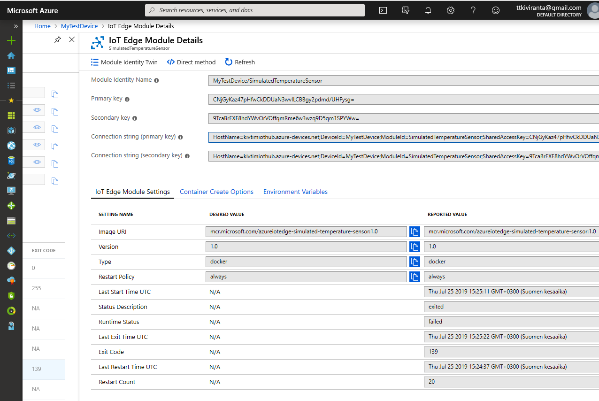
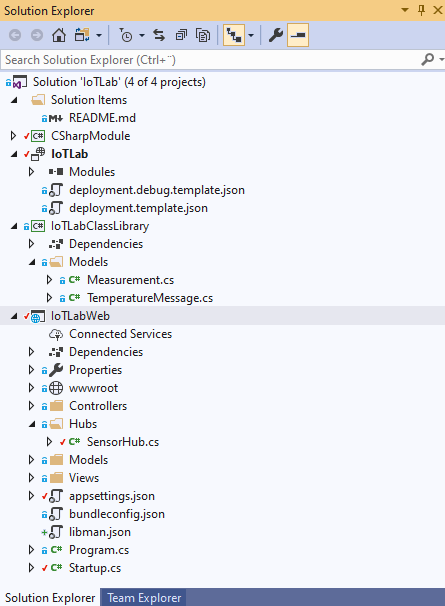
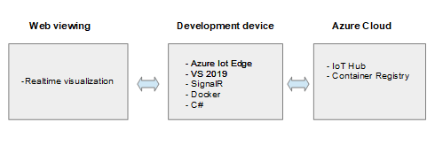
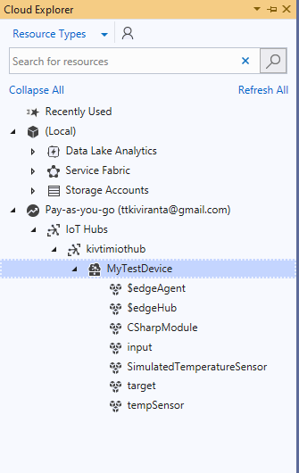
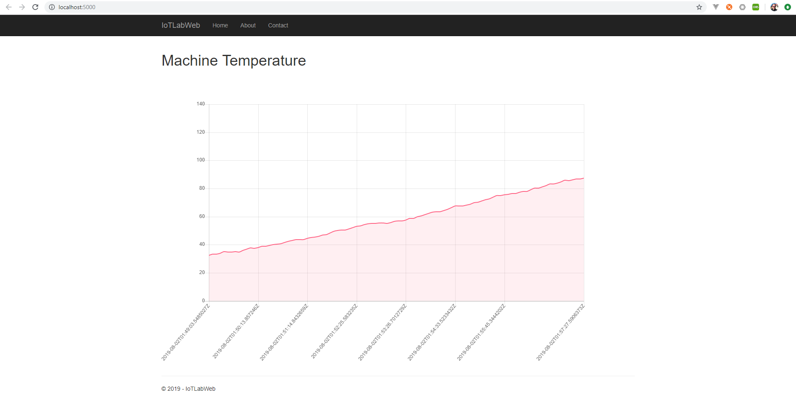
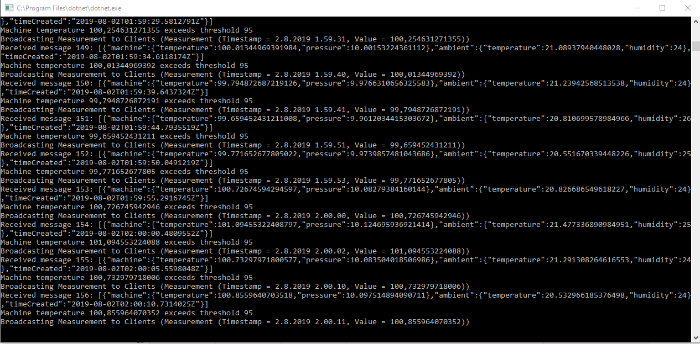

IoTLab
==============

In this project I get live sensor data via Azure IoT Hub to a web client using SignalR where the web backend is runing ASP.net Core. I used simulated temperature sensor in IoT Edge modul:

The solution consists of four projects, please refer to the picture below:

Next picture describes this demos architecture:

**Key words**

Visual Studio 2019, ASP.NET Core, Azure IoT Hub, Azure IoT Edge, SignalR, Docker, C#

**Screen captures**

